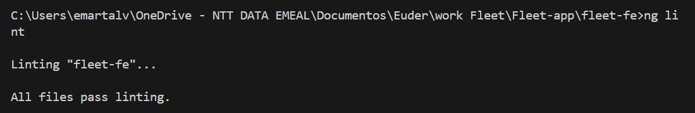
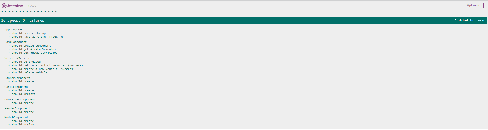
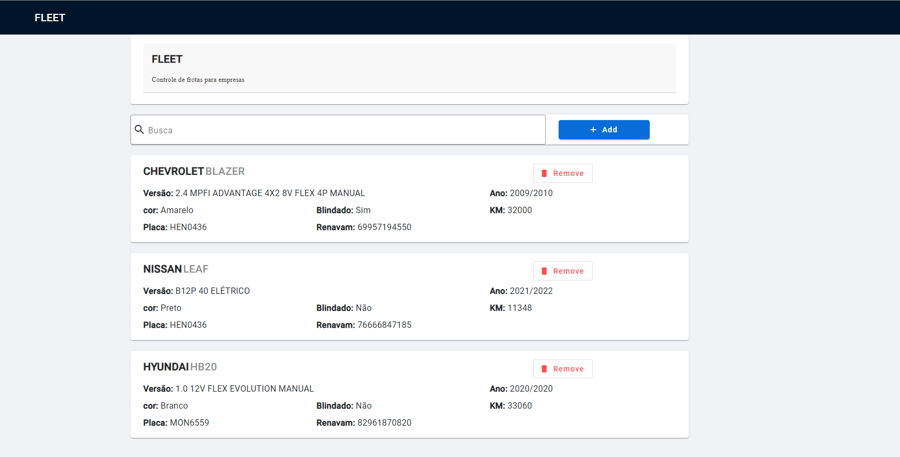
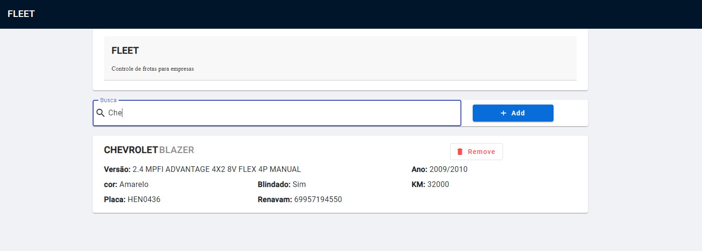
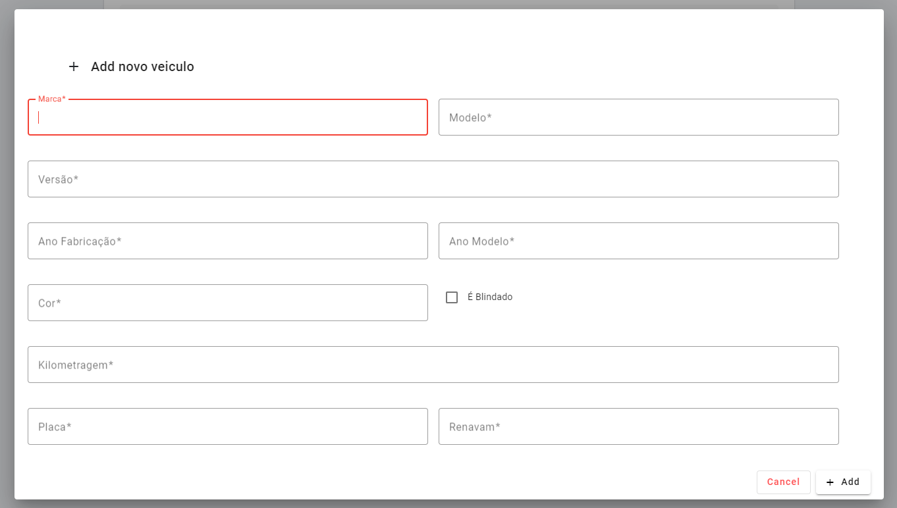
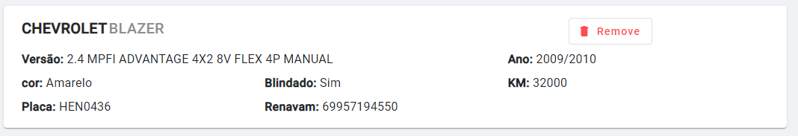

## **FLEET: Gerenciamento de Frotas Seminovos com Angular 16**

**O FLEET é um aplicativo web completo para gerenciar frotas de veículos seminovos com eficiência e praticidade.**

### **Funcionalidades:**

- Cadastro, visualização e exclusão de veículos;
- Busca e filtragem avançada para encontrar os veículos desejados rapidamente;
- Integração com API para acesso a dados em tempo real;
- Interface amigável e intuitiva para uma experiência de usuário agradável.

### **Pré-requisitos:**

- Node.js instalado;
- npm instalado globalmente.

### **Instalação:**

1. Clone o repositório do projeto:

git clone https://github.com/EuderAlves/Fleet-app.git

2. Navegue para a pasta do projeto:

cd fleet-fe

3. Desinstale o Angular CLI versão 17 (se instalado):

npm uninstall -g @angular/cli

4. Instale o Angular CLI versão 16:

npm install -g @angular/cli@16.0.0

5. Instale as dependências do projeto:

npm install

6. Inicie a aplicação:

npm start

7. A aplicação estará disponível em http://localhost:4200.

### **API:**

A API utilizada pelo FLEET está na pasta api-fleet. Para executá-la, siga os passos:

1. Clone o repositório do projeto:
   git clone https://github.com/EuderAlves/Fleet-app.git

2. Navegue para a pasta api-fleet:

cd api-fleet

2. Instale as dependências da API:

npm install

3. Execute a API:

npx json-server db.json

4. A API estará disponível em http://localhost:3000.

### **Observações:**

- Todas as requisições de POST para esta API devem conter o header `Content-Type: application/json`.
  Esta API contém as seguintes rotas:

- `GET /veiculos` : lista os veículos cadastrados
- `POST /veiculos` : cria um novo veiculo
- `DELETE /veiculos/:id` : apaga o veiculo com ID :id

Para filtrar os veiculos em `GET /veiculos`, é possível:

- fazer uma busca global utilizando a query string `?q=:busca`;
- fazer uma busca por placas individuais utilizando a query string `?placa=:busca`.

**Com o FLEET, você terá o controle total da sua frota de veículos seminovos, otimizando a gestão e aumentando a produtividade.**

EsLint 100% :

Execução testes:

Tela inicial da aplicação:

Aplicação realiza filtro de carro ao digitar as especificações no campo "Busca":

Opção para adicionar um novo carro clicando no botão "+ Add", após preencher as informações e salvar ele irá aparece na tela inicial.:

Opção de remover carro no botão "Remover":
